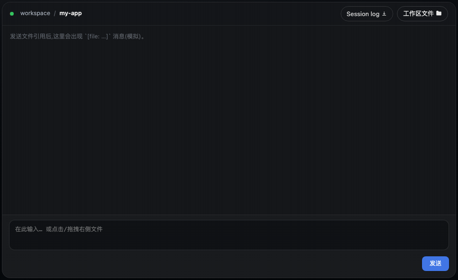
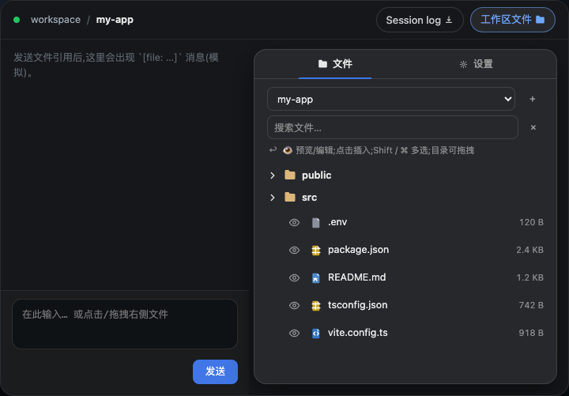
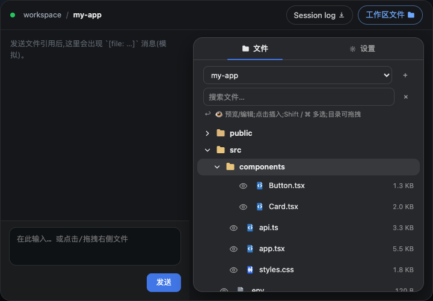
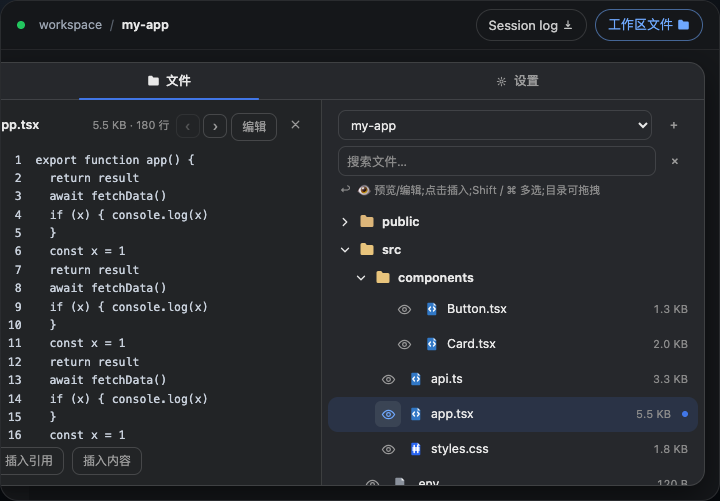
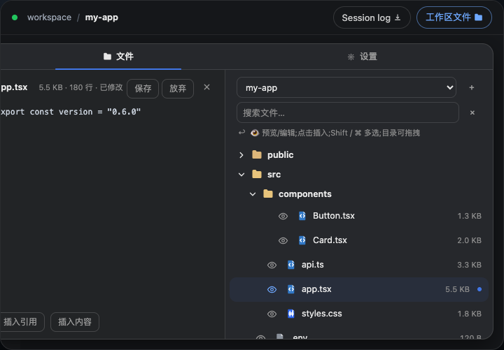
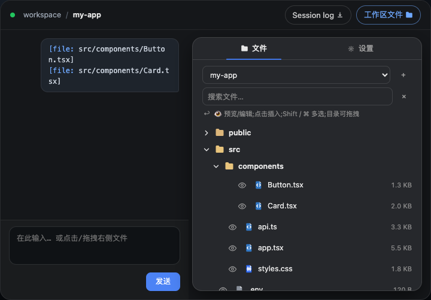

# dsh-workspace-explorer

> 自维护 fork（[doubleelec](https://github.com/doubleelec)）—— 基于
> [Jiyr0119/dsh-workspace-explorer](https://github.com/Jiyr0119/dsh-workspace-explorer) v0.7.1（MIT）。
> npm 包：`@doubleelec/dsh-workspace-explorer`。

[English](README.md) | **中文**

[](LICENSE)
[](https://github.com/doubleelec/dsh-workspace-explorer/stargazers)
[](https://github.com/doubleelec/dsh-workspace-explorer)

<p align="center">
  ⭐ 顺手留颗 Star,维护者能高兴一整天 &nbsp;·&nbsp; <a href="https://github.com/doubleelec/dsh-workspace-explorer">行,给你一颗 Star</a>
</p>

> 给 DeepSeek Harness Web UI 的工作区文件资源管理器:会话头部一个**「工作区文件」胶囊按钮**(功能名称 + 文件夹图标,与 Session log 按钮同排)打开动画弹窗,展示当前工作区目录树;点击文件即预览,一键分享进对话,也可拖进输入框。

灵感来自 VS Code / Cursor 的项目目录树,弥补 DSH 添加工作台后没有目录视图的空白。

## 为什么用它

- **先预览,绝不误触** — 点击文件行只在独立「预览」Tab 打开,不会往草稿里乱塞文本。分享是显式动作:行首的 ⏎ 箭头按钮指向左下输入框,图标自己就说了文件要去哪。
- **Markdown 就该是排版的样子** — `.md` / `.mdx` 默认渲染(标题/列表/代码块/引用/表格/任务列表),一键切回源码。零依赖手写渲染器,React 元素构建,天生防 XSS,不用消毒库。
- **花式引用,一步到位** — 单击分享、拖拽到光标处、Shift / ⌘ 多选批量插入,或在输入框打 `@` 模糊搜全树文件(5000 条 / 10 层),面板不开也能用。
- **不用离开就能改** — 预览面板一键进编辑态(保存/放弃/取消),保存时检测外部修改,直接写盘。
- **该大就大** — 头部一键全屏覆盖整个会话区,看大文件/长 MD,再点(或 `Esc`)回来。
- **绝不挡路** — 弹窗在会话头部与输入框之间实时测量,永不盖住输入框;左下角拖拽调大小并记忆(双击恢复);噪声目录自动隐藏,大小显示、相对/绝对引用格式都可实时调。

## 🖥 演示 Demo



*演示 GIF(录制于 v0.5.1):「工作区文件」胶囊入口、多选批量插入、目录拖拽 → 紧凑目录树文本、分页预览与设置页。新版预览 Tab、文件编辑与 Markdown 渲染见下方截图。*

<details>
<summary><b>截图</b> Screenshots</summary>











</details>

## 功能特性

- 📂 **动画弹窗** — 会话头部右侧(与 session log 同排)的**「工作区文件」胶囊按钮**(功能名称 + 文件夹图标,与 DSH 原生 **Session log** 下载按钮同款样式)点击后,弹出一个带淡入/缩放动画的浮动面板;弹窗位置实时测量,**位于会话头部与输入框之间**(聊天区右侧),绝不会盖住输入框。**左下角拖拽调大小**(宽+高,localStorage 记忆,双击恢复)
- 🗂 **顶部 Tab 栏** — 文件 / 预览 / 设置;设置页实时调节行为(隐藏噪声目录、显示大小、引用格式),并同步进 DSH 设置 → 工作区文件
- 🗂 **懒加载展开** — 目录按需加载,自动隐藏 `node_modules` / `.git` / `dist` / `__pycache__` 等噪声目录
- 🎨 **文件类型图标** — 按扩展名着色的实心文档徽标(TS / JS / Python / JSON / Markdown / 图片 / 配置 / 脚本等),目录为琥珀色文件夹、展开态高亮;正在预览的文件带蓝色圆点
- 🖱 **点击预览** — 点击文件行(或 `Enter` / `空格`)在「预览」Tab 打开;行首 **⏎ 按钮**把 `@路径` 引用插入输入框(`@` / `i` 快捷键亦可)
- ⛶ **全屏模式** — 头部关闭键旁的按钮一键全屏(看大文件/长 MD),再点恢复;`Esc` 先退全屏再关闭
- 🖱 **拖拽插入** — 文件拖到输入框内任意位置在光标处插入(带全屏虚线提示),拖到其他位置则追加到末尾;**目录也可拖拽**,松开即插入限层数的紧凑目录树文本
- 🖱 **多选批量插入** — Shift / ⌘ 点击多选,一键批量插入(文件 → 引用,目录 → 目录树)
- ⌨️ **随处 `@` 引用** — 输入框打 `@` 模糊搜工作区文件(文件名或路径,50 条候选,500 个路径高亮),面板不开也能用(会话 cwd 自动发现)
- 🌓 **跟随主题** — 全部使用 DSH 的 `--dsw-alias-*` 设计 token,浅色/深色自动适配;原生弹窗外观(16px 圆角、lv3 阴影)
- 🔍 **搜索过滤** — 按文件名过滤整棵树(5000 条 / 10 层,显示匹配数)
- 📝 **Markdown 渲染** — `.md` / `.mdx` 默认渲染排版(标题、加粗/斜体/删除线、代码块带语言标签、引用、有序/无序/任务列表、表格、分隔线);一键切回源码;超大分页文件自动回落源码
- ✏️ **预览 Tab** — 整文件视图(≤512KB 一次读完,更大走分页并显示总行数与当前页);可插入引用,小文件(≤32KB)可直接插入完整内容
- 📝 **文件编辑** — 预览面板点击「编辑」进入 textarea 编辑态,支持保存/放弃/取消;保存时检测文件外部修改
- 🌐 **国际化** — 通过 DSH locale 服务注册中/英词典,面板跟随 DSH 界面语言切换

## 快速开始

### 安装与使用

一条命令装好完整插件,无需构建、无需改任何配置。npm 包同时提供原生 Host 半区(`lib/index.js`,webServer JSON 路由 `/dsh-we/api/list|peek|tree|config|write`)和浏览器 bundle(`lib/client.js` 经 `dsh.plugin.json`)。

```bash
dsh plugin --profile web add -w @doubleelec/dsh-workspace-explorer@latest
```

(或在 DSH 市场点击安装按钮)。安装后会话头部即出现**「工作区文件」胶囊(名称 + 图标)**;必要时重启或硬刷新 Web UI。这是零配置、免构建的路径。

> ℹ️ **pnpm 提示**:现代 pnpm(9/10)会拒绝在 workspace root 直接 add(`ERR_PNPM_ADDING_TO_ROOT`),故命令带 `-w`。另一种做法:在 `~/.dsh/profiles/web/.npmrc` 写入 `ignore-workspace-root-check=true`。

> ⚠️ **常见误解**:收录本身不会自动安装任何东西 —— 用户仍需点安装。安装后即出现完整 UI(原生 bundle,无启动报错)。

详细步骤见 [`docs/install.md`](./docs/install.md)。

### 使用

1. 点击会话头部右上角的**「工作区文件」胶囊按钮**(功能名称 + 文件夹图标,与 Session log 按钮同排)打开弹窗
2. 展开目录浏览文件,**点击文件即预览**
3. 点行首 **⏎ 按钮**(或把文件拖进输入框,或打 `@` + 文件名)引用它,然后发送
4. 用弹窗顶部的「设置」Tab(或 DSH 设置 → 工作区文件)调整面板行为

## 目录结构

```
dsh-workspace-explorer/
├── README.md             # 文档 — English(默认)
├── README.zh.md          # 文档 — 中文
├── LICENSE               # MIT
├── CHANGELOG.md          # 变更记录
├── manifest.json         # 插件元信息
├── package.json          # npm 包(@doubleelec/dsh-workspace-explorer)
├── demo/
│   ├── index.html        # 交互式模拟预览(GitHub Pages)
│   └── preview.gif       # 演示动图(README)
├── .github/
│   └── workflows/
│       └── pages.yml     # 部署 demo/ 到 GitHub Pages(手动;预览已隐藏)
├── docs/
│   ├── install.md        # 安装指南
│   ├── local-debugging.md# 本地开发(symlink + dev profile)
│   └── publish.md        # 发布流程(GitHub + npm)
├── src/
│   ├── index.ts          # 原生 Host 半区:webServer JSON 路由(/dsh-we/api/*)
│   └── client/
│       ├── index.tsx     # 原生 Client 半区:弹窗 + 文件树 + 预览 + 拖拽
│       ├── markdown.ts   # 零依赖 Markdown 解析/渲染(防 XSS)
│       ├── format.ts     # 纯格式化工具
│       └── popupLayout.ts# 弹窗几何计算(单测覆盖)
├── test/                 # vitest 套件(format / host / popupLayout / markdown)
└── lib/                  # 构建产物(lib/index.js + lib/client.js)
```

## 实现要点

| 能力 | 机制 |
|---|---|
| 目录读取 | Host `fs` 经 `resolveRel` 限定的 root+rel(`/dsh-we/api/list`),目录优先,400 条上限 |
| 文件预览 | ≤512KB 整读,更大走行偏移缓存分页(`/dsh-we/api/peek`);二进制嗅探,≤32KB 可内联 |
| 目录树/搜索索引 | 限深/限预算递归(`/dsh-we/api/tree`,10 层 / 5000 条) |
| 文件写入 | `/dsh-we/api/write`,按大小检测外部修改 |
| Host→Client 通信 | 同源 `fetch POST /dsh-we/api/*`(路径约束,无任意路径读取) |
| 弹窗 | `shell.overlay` 槽位(`useWorkspaces` / `useSessions`),会话头部与输入框之间实时测量;左下角拖拽调大小并记忆 |
| 开关按钮 | `conversation.session.header.utilities` 槽位(「工作区文件」胶囊:名称 + 图标) |
| 写入输入框 | `conversation.input.dock` → `inputActions.setDraft`,另有 `conversation.input` 服务兜底 |
| `@` 提及 | `inputTriggers.registerSource`(模糊候选 + lexicon 高亮),根目录从 sessions cwd 自动发现 |
| 拖拽插入 | HTML5 DnD;输入框内走原生光标插入,其他位置追加 |
| Markdown | 手写解析器 → React 元素(无 `innerHTML`);源码切换;分页回落 |
| 主题/国际化 | `--dsw-alias-*` CSS 变量(浅/深色);中/英经 DSH locale 服务 |

## 版本

当前版本 **v0.8.0** — **预览优先交互**(点行预览、↙ 分享)、**Markdown 渲染**、**会话区全屏**、**单包清理**(删除动态粘贴版)。
变更记录见 [CHANGELOG.md](./CHANGELOG.md)。

## Roadmap

聚焦两条与产品真正相关的主线:**读路径**(把模型指向代码)与**写路径**(编辑文件)。其余事项全部挪到 Backlog 搁置,不再与产品功能平级。

**已完成 ✅**

- [x] v0.1 核心:右侧文件树、点击/拖拽插入引用、DSH 原生观感
- [x] 全树搜索过滤;小文件(≤32KB)内容插入
- [x] 国际化(zh/en,跟随 DSH 界面语言)
- [x] `@` 提及源(sessions cwd 自动发现 + lexicon 高亮);统一 `@路径` 引用格式
- [x] 演示页中英切换、GitHub Pages 预览、演示 GIF、市场截图素材
- [x] npm 包 + `dsh.bundle` 契约 + awesome 列表
- [x] 多目标引用:目录拖拽(紧凑目录树)+ 多选批量插入
- [x] 整文件预览(≤512KB),大文件分页回落
- [x] 预览优先交互:点行预览、⏎ 分享、`@` / `i` 快捷键
- [x] Markdown 渲染(零依赖、防 XSS) + 源码切换
- [x] 面板内文件编辑 + 外部修改检测
- [x] 弹窗可调大小并记忆;预览独立 Tab

**搁置 Backlog**(出现真实需求再做)

- 跨已加载目录的内容搜索(host 侧 grep);最近文件 / 收藏夹
- 完整键盘导航;复制路径 / 在系统文件管理器中显示
- 虚拟滚动(超大目录);浅/深色主题回归检查;Playwright e2e
- CI(lint + e2e + 自动发布)

## License

[MIT](./LICENSE)
