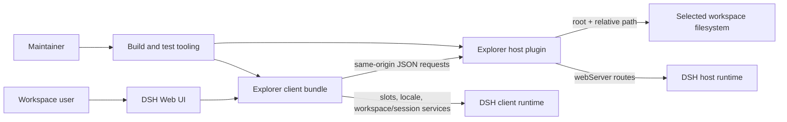

# Architecture — dsh-workspace-explorer

## 1. Identification and scope

**System:** `@doubleelec/dsh-workspace-explorer` (plugin id `elec-workspace-explorer`).  
**Purpose:** provide a DSH web workspace file explorer with file listing, bounded preview/edit operations, Markdown/HTML rendering, search/reference interactions, and a browser UI.  
**Scope:** the active native Cordis host and browser client, package/build artifacts, maintainer setup, demo, and the retained compatibility host entry. `lib/` and `scripts/setup.ps1` are operational/package content, not stable governed modules under the current Architecture Kit Python inventory. DSH itself and its runtime services are external.

## 2. Stakeholders and concerns

- **Workspace users:** safe access to workspace files, responsive file preview, predictable file-reference insertion, and a usable UI.
- **Plugin maintainers:** reproducible host/client builds, clear package metadata, and testable behavior.
- **DSH integrators:** correct host/client entrypoints, runtime service/slot contracts, and installation compatibility.
- **Security reviewers:** filesystem operations remain confined to a selected workspace root; rendered content does not become privileged host DOM.

## 3. Quality attribute scenarios

- **Filesystem safety:** given a request containing a workspace root and relative path, the host rejects missing roots and unsafe path segments before file operations; the `resolveRel` tests in `test/host.test.ts` exercise this boundary.
- **Bounded resource use:** large files are paged/scanned in chunks, whole-file previews are capped, and recursive tree results have depth/entry budgets.
- **Client resilience:** stored popup dimensions are clamped and previews can restore state without forcing content into the composer.
- **Distribution reproducibility:** one build emits the Node ESM host, browser bundle, and declaration files referenced by package/plugin metadata.

## 4. Viewpoints and views

### 4.1 Context view

### 4.2 Logical decomposition view

The machine-readable inventory and dependency declarations are in [`architecture.toml`](../architecture.toml) and module manifests. The source boundary comprises:

- `src/index.ts`: host HTTP route registration, path validation, bounded listing/peek/tree operations, and writes.
- `src/client/`: UI composition plus isolated formatting, Markdown/HTML handling, Mermaid loading, popup geometry, and preview-state helpers.
- `lib/`: generated host/client bundles and declarations; not hand-maintained source and intentionally outside the stable governance inventory because `tsdown` cleans this directory.
- `scripts/setup.ps1`: maintainer installer; tracked as operational packaging content, but not represented in the Python governance inventory because its direct-child scanner only recognizes directories and `.py` files.
- `tsdown.config.ts`: root-level build configuration for host and browser bundles.
- `compat/`: legacy composition mount retained separately from the active native entry.
- `assets/`, `demo/`, `.github/`: screenshots/demo and repository automation.

The active client calls host routes using same-origin requests; the host delegates filesystem work to Node APIs after resolving paths against the requested workspace root. The browser client separately uses DSH-provided slots/services.

### 4.3 Module documentation map

| Module | Docs bucket | Reason | Module doc paths |
|---|---|---|---|
| `src` | top-level only | Active plugin source, documented here and in DEV.md; client has no independent delivery cadence. | - |
| `src/client` | top-level only | Closely coupled UI and helper modules delivered as one browser bundle. | - |
| `assets` | top-level only | Static docs imagery. | - |
| `assets/screenshots` | top-level only | Static image set. | - |
| `demo` | top-level only | Demonstration content, not a separately shipped runtime. | - |
| `.github` | top-level only | Small repository workflow set. | - |
| `.github/workflows` | top-level only | CI/release automation with no separate design lifecycle. | - |
| `compat` | top-level only | Small legacy entry retained for compatibility. | - |

### 4.4 Runtime/data-flow view

1. DSH loads the host entry and client bundle using package/plugin metadata.
2. The client derives workspace context from DSH services and issues same-origin requests to `/dsh-we/api/*`.
3. The host validates the root-relative path, applies limits, performs filesystem operations, and returns JSON.
4. The client renders results and, for explicit share/edit actions, uses the relevant DSH input service or host write route.

### 4.5 Deployment view

The package is installed into a DSH profile. `lib/index.js` executes in the Node host runtime and `lib/client.js` is loaded by the browser module loader. `scripts/setup.ps1` is a local maintainer convenience; `demo/` is independent static content. No separate service or database is introduced by this plugin.

## 5. Architecture decisions

- **Single package, split host/client bundles:** package metadata declares distinct Node and browser entrypoints, keeping filesystem access on the host and UI logic in the browser.
- **Same-origin JSON routes:** host/client coordination uses the existing webserver and avoids exposing arbitrary filesystem APIs to the browser.
- **Path confinement and bounded reads:** filesystem addressing is root plus relative path; listing, preview, and tree operations impose limits.
- **Generated `lib/` artifacts:** the source and build configuration are authoritative; declarations and bundles are build output.
- **Compatibility entry retained:** the former composition mount remains under `compat/` rather than competing with the active native plugin entrypoint.

## 6. Constraints and risks

- The plugin depends on DSH runtime slot/service identifiers and module-loader behavior; integration changes upstream may require coordinated updates.
- `lib/` is generated package content and is cleaned by `tsdown`; it is intentionally excluded from the stable governance module tree, so governance files must not be stored there. Vendored governance tests are normalized to LF and pinned by `.gitattributes`, because `arch_engine.py check` compares template bytes exactly while `sync-tests --diff` compares normalized text.
- The Python governance adapter does not inventory `.ps1` files, while the Architecture Kit engine does. `scripts/` is therefore excluded from the governed module tree by design and `scripts/setup.ps1` remains intact as operational packaging content; treat this as a documented adapter limitation, not a reason to rename or break the installer.
- Rendering and filesystem behavior have different trust boundaries; browser preview must not gain arbitrary host access, and host routes must continue validating root-relative paths.
- The compatibility entry is explicitly not the active interactive implementation; documentation must avoid confusing it with the native plugin.

## 7. Test architecture

- **Unit tests (ticket scope):** Vitest suites in `test/` exercise individual parser, formatting, state, geometry, HTML/Mermaid, and host filesystem behaviors. Run with `npm test`.
- **Integration tests (spec scope):** no separate integration-test layer currently exists. The host route tests and client helper tests are unit-level; when a spec requires real DSH runtime integration, add a dedicated harness and gate it explicitly rather than silently upgrading the current suites.
- **System tests (two or more specs / whole effort):** no DSH end-to-end suite currently exists; Playwright is parked backlog per README. Release verification currently combines build, typecheck, Vitest, and architecture governance checks.
- **Architecture governance:** vendored pytest tests in `tests/governance/` inspect manifests, boundaries, contract metadata, test index, and module kit completeness. Run with `python -m pytest tests/governance`.
- **Layer overrides:** none declared. Vitest does not currently provide live DSH runtime system coverage.

## 8. Module dependency inventory

`src/client` depends on its local helper modules, React and the DSH input-trigger client API. `src/index.ts` depends on Node filesystem/path modules and Cordis. Build output consumes source and package metadata. The legacy `compat` entry is isolated and is not imported by the active source modules.
